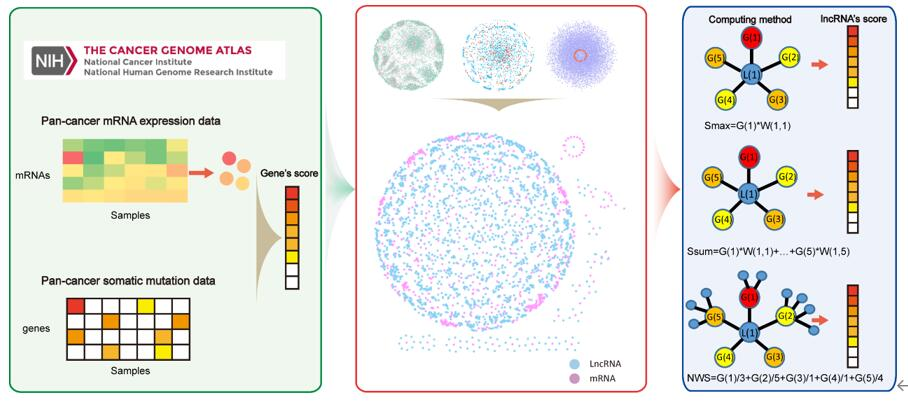

# LNCMO
The workflow of our method


This research presents three methods for calculating the one-step neighbor score of lncRNA in network: DNmax, DNsum, and NWsum. Take the NWsum method as an example to illustrate：

```perl
open(DATA, "gene-score.txt")  ##The input file here is the comprehensive score of the gene
open(NET,"integratedNet-brca.txt")  ##The input file here is the integrated network; the integrated network lncRNA in this study is Ensembl ID, and mRNA is gene symbol
open(O, ">lncRNA-mRNA-result.txt") ##The output file here

```

The obtained output file lncRNA-mRNA-result.txt contains the corresponding scores of lncRNA and mRNA. Use get-lncRNAscore.pl to screen out the scores of lncRNA.

```perl
open IN ,"<lncRNA-mRNA-result.txt" ##The input file here
open OUT, ">lncRNA-score.txt"      ##The output file here，which include lncRNA risk score
```
